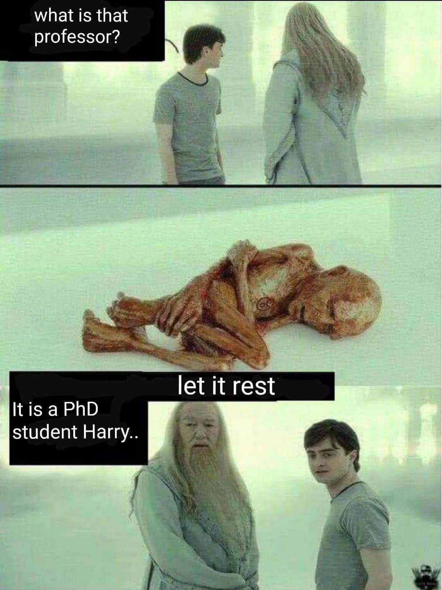

Hello World!

Thought it would be good to start things off with a little blog post all about me 👋🏼 

If you've already read 'about me', you'll know I'm currently a Ph.D candidate. If not, then I'm currently a Ph.D candidate. 

I'm hoping this site will serve both as a deposit for my experiences and projects of interest as well as a trash bin for all my Ph.D thoughts and jargon. As I'm currently in my final year of the Ph.D there is an ever ticking time bomb in the back of my head reminding me the time for a real-life-adult-world job is nearing. It could be argued that now is the prime time for me to start getting things together that will set me up for success when and if I finally decide to leave the student life behind. So begins the journey of creating a website (thanks to `blogdown`, this has been relatively pain-free) in the hope that it keeps me building on my skills and interesting projects that will see me through to the real-life-adult-world.

{width=50%}

If you're mildly interested in seeing how this pans out, stick around!
